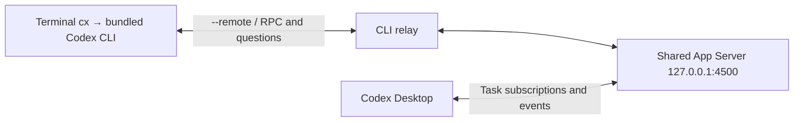

# Codex Bridge

**Use the Codex desktop app’s bundled CLI to share sessions and task information between terminal and desktop.** A macOS bridge connecting both clients to one local Codex App Server, with session continuation, task subscriptions, question adaptation, and native Desktop pet status.

[](https://github.com/houhongxu/codex-bridge/actions/workflows/ci.yml)
[](LICENSE)

[简体中文](README.md) · English · [Architecture](docs/architecture.md) · [Troubleshooting](docs/troubleshooting.md)

> Experimental: **0.3.0-alpha.1**. This is a community project, not affiliated with or endorsed by OpenAI. Desktop deep links, external-server configuration and log formats are version-dependent. Attaching a task can navigate the desktop to that task.

CLI naming of an unmaterialized paginated thread first asks the backend to persist its history, so manually opening the named empty task in Desktop can recover it. No placeholder message is sent. If persistence cannot be confirmed, send the first message in CLI and retry naming.

## 0.3 migration (breaking change)

The only command changes from `cb` to lowercase `cx`; the project remains **Codex Bridge** and the source entry point is `cx.py`. No `cb`, `cpet`, or `codex-pet` compatibility commands are provided. Reinstall to replace the managed alias block, remove links pointing to the old installed scripts, and update the next-login command. Open a new terminal, or run `unalias cb cx cpet 2>/dev/null; source ~/.zshrc`. Unrelated user-owned commands and files are preserved.

Use `cx` to launch CLI, `cx resume <name-or-id>` to resume, and `cx status` for bridge status. `cx --help` / `cx --version` describe Bridge; `cx cli --help` / `cx cli --version` describe the official CLI. Management commands `on/off/enable/disable/status/install/uninstall/login-start` are reserved; use `cx cli ...` to forward conflicting arguments to CLI.

Configuration variables remain `CB_PYTHON` and `CB_QUESTION_SYNC`; old `CPET_*` names are no longer read. Existing server addresses, session storage, launchd labels, and runtime directories remain in place. Running tasks are not restarted; relaunch after finishing current work to load the update. The GitHub repository is `houhongxu/codex-bridge`.

## Why a bridge is needed

Install and sign in to **Codex Desktop** first. `cx` invokes the desktop app’s bundled Codex CLI directly, rather than resolving `codex` from `$PATH`. A separate npm `@openai/codex` installation is not required. The terminal CLI and shared App Server start from the same app bundle; after a desktop update, finish active work and restart old processes to load the new binary.

**The same CLI executable does not automatically mean the same running session.** Directly launching the bundled CLI aligns versions but does not connect both frontends to one running server or subscribe Desktop to the same task.

| Setup | CLI version | Live desktop/terminal session |
| --- | --- | --- |
| Separate npm `codex` + Codex Desktop | May differ | Not automatically shared |
| Run the desktop’s bundled `codex` directly | From the same desktop installation | Not automatically shared |
| `cx` + Codex Desktop | CLI and shared server use the same app bundle | Shared after both connect and subscribe to the same task |



`cx on` starts the bundled CLI with `app-server --listen ws://127.0.0.1:4500` and configures the desktop connection. `cx` starts terminal CLI with `--remote` pointing to a temporary relay, which connects upstream to the shared App Server. Both frontends can receive messages and task events for the same subscribed task, continue its session, and synchronize live async question answers through the adapter.

Shared task information still uses each frontend’s own presentation. Historical unanswered questions must be answered in Desktop; simultaneous answers are not atomically deduplicated. Desktop-only tools, permissions, and UI state can differ. See [question synchronization](#async-question-synchronization) and [compatibility](docs/compatibility.md).

## What it does

`cx` connects the CLI and desktop to the same local Codex App Server. A per-CLI relay opens eligible tasks in the desktop when needed, allowing the desktop to subscribe and its existing pet UI to display task activity. Confirmed subscriptions are reused across turns; reconnection or unsubscription invalidates them. Ephemeral and unclassified tasks do not trigger navigation.

A reachable server, a log-confirmed subscription and a visible pet activity pill are separate outcomes. cx does not install or unlock the native pet.

Empty new threads attach after the first input is forwarded and their local history becomes readable. Waiting for history or desktop subscription does not block CLI messages or approvals. Existing persisted threads can attach on resume/fork.

## Requirements

- macOS and zsh for automatic aliases.
- Python 3.9+ with `venv`; a supported Python 3.11+ is recommended.
- Codex Desktop at `/Applications/ChatGPT.app` or `/Applications/Codex.app` with a bundled `Contents/Resources/codex-cli/bin/codex` (or legacy `Contents/Resources/codex`) supporting `app-server --listen`, `--remote` and `--remote-auth-token-env`.
- An authenticated desktop app, plus a free `127.0.0.1:4500`.
- The native pet feature is optional and needed only for pet status display.
- Network access to install the pinned `websockets==15.0.1` dependency from PyPI.

See the [tested compatibility scope](docs/compatibility.md). Windows, Linux desktop integration and other vendors' CLIs are not supported.

## Install and run

```sh
mkdir -p ~/workspace
git clone https://github.com/houhongxu/codex-bridge.git ~/workspace/codex-bridge
cd ~/workspace/codex-bridge
./install.sh
source ~/.zshrc
cx --version
cx on
cx status
```

If the desktop was already running before `cx on`, finish its tasks, quit it, then run `cx on` again. The external-server setting takes effect at desktop startup; cx never forcibly restarts it.

```sh
cd /path/to/your/project
cx
# Select an existing task across project directories:
cx resume --all
```

Enable the pet in the desktop and check an active task. First attachment or recovery may navigate the app; subsequent turns reuse the subscription. `--all` expands the resume picker scope; it does not run every task.

Optional login startup: `cx enable`. Disable login startup without stopping current work: `cx disable`.

## Async question synchronization

Since `0.1.0-alpha.2`, new `cx` sessions adapt **live async questions received after connecting**. Answering in Desktop dismisses the matching CLI question; answering in the CLI submits the Desktop-compatible answer to the same task. No official CLI or desktop files are patched.

The CLI uses its standard question dialog, including its `Esc` interruption behavior. Historical question text is retained, but old dialogs are not recreated; answer outstanding historical questions in Desktop. Known duplicate or late answers are suppressed, but simultaneous submissions from two clients are not atomically coordinated.

If cx cannot confirm an answer, check Desktop before replying again: it never retries automatically. To restore native question passthrough, run `CB_QUESTION_SYNC=0 cx resume --all`. Restart old CLI sessions after upgrading. See [tested versions and limits](docs/compatibility.md).

Since `0.1.0-alpha.3`, recognized answer envelopes appear as readable question/answer text in live CLI messages and restored history, using the labels `问题：` (Question) and `你的回答：` (Your answer). IDs and JSON remain intact in backend storage and submitted messages. Only the CLI-facing copy is formatted; ordinary text, quoted examples and unknown formats pass through. `CB_QUESTION_SYNC=0` also disables this formatting.

## Installed files are independent of the checkout

The installer copies code into `~/Library/Application Support/Codex CLI Bridge/runtime/` and creates its own `.venv` there. `~/.local/bin/cx` points to that installed copy. Moving or deleting the source checkout does not break installed commands. Re-run `./install.sh` to deploy source updates.

The installer backs up modified `.zshrc` files and refuses conflicting `cx` aliases or functions outside its managed block. It does not start the service or enable login startup by default. Set `CB_PYTHON=/path/to/python3` to choose the interpreter.

## Commands

| Command | Purpose |
| --- | --- |
| `cx`, `cx resume --all`, `cx fork` | Start, resume or fork an interactive task |
| `cx on` | Prepare the server and desktop connection |
| `cx off` | Stop the shared server; interrupts tasks using it |
| `cx enable` / `disable` | Enable / disable login startup |
| `cx status` / `status --json` | Read diagnostics; output messages are currently Chinese |
| `cx --version` | Show the installed version |
| `cx uninstall` | Remove service configuration, aliases and command; retain installed files and logs |

New tasks use the terminal's working directory. Resume/fork retain the existing task directory unless explicitly overridden. `cx` is not a general wrapper for every Codex subcommand.

## Update or uninstall

Installing updated scripts does not restart the shared server or desktop. Existing `cx` processes keep their old code. Finish active work before restarting those CLI sessions or stopping the server.

```sh
cd /path/to/codex-bridge
git pull --ff-only
./install.sh
```

Restart old CLI sessions with `cx resume --all` to use updated relay code. Source edits alone do not change the installed runtime.

Run `cx uninstall`, quit/reopen the desktop, and open a new terminal to restore ordinary usage. Source files, installed runtime, backups and logs are retained. `cx off` alone does not disable login startup.

## Limitations and security

- Desktop navigation remains necessary for first attachment or recovery.
- Native desktop logging/configuration may change after app updates.
- A launchd server can differ from the terminal or built-in desktop server in proxy settings, macOS directory permissions and desktop-only tool context.
- The fixed shared server has no additional cx authentication; temporary per-CLI relays require a random Bearer token. Keep all listeners on loopback. See [SECURITY](SECURITY.md).
- Muted tasks, hidden activity pills, or read/idle tasks may not appear on the pet.
- Custom `CODEX_HOME`, alternative app locations, concurrent desktop instances and remote hosts are unverified.

## Development

```sh
python3 -m venv .venv
.venv/bin/python -m pip install -r requirements.txt
.venv/bin/python -m unittest discover -s tests -v
python3 scripts/check_repository.py
sh -n install.sh
```

Tests use temporary homes and local WebSocket fixtures, without real model requests or launchd changes. Linux CI checks portable logic, not macOS integration. Read [CONTRIBUTING](CONTRIBUTING.md), [CHANGELOG](CHANGELOG.md), and [the roadmap](docs/roadmap.md). Detailed maintenance documents currently use Chinese; concise English reports and contributions are welcome.

## License

[MIT](LICENSE), copyright 2026 houhongxu. This repository includes cx code only, not OpenAI applications, models or pet assets.
