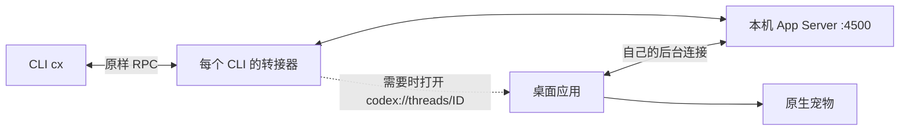

# 实现原理

## 一句话

CLI 与桌面共用本地 App Server；转接器让桌面打开并订阅 CLI 的普通任务，宠物使用桌面已有的任务状态。



后台是本机运行的 Codex 服务进程，负责管理任务和工具执行并调用模型服务；cpet 不在本机部署模型。

## 建立订阅

1. `cx` 准备 launchd 管理的共享后台，并为自己的 CLI 启动临时 WebSocket 转接器。
2. 转接器关联该连接的 `thread/start`、`thread/resume`、`thread/fork` 请求与响应；只有明确 `ephemeral: false` 的成功响应才进入可接入集合。
3. 对未确认订阅的任务执行 `open -g -a <app> codex://threads/<id>`。
4. 桌面打开任务后，用自己的连接调用 `thread/resume`，加载任务并接收后续事件。这与脚本自己建一个订阅连接不同：事件需要到达桌面所持有的连接。
5. 转接器从当前桌面进程的日志检查订阅证据；宠物是否显示仍受桌面 UI 状态影响。

[官方 App Server 文档](https://learn.chatgpt.com/docs/app-server) 说明任务与事件接口；deep link、日志字段和桌面外部后台环境变量是本机实现观察，不构成官方稳定接口承诺。

## 为什么后续提问不再导航

普通任务的 `turn/start` 仍触发检查，但已确认的订阅直接复用。`inactive_thread_unsubscribed` 清除对应任务的缓存；本地后台连接变化、桌面进程变化或日志证据缺口会使缓存失效。页面变为不活跃本身不会清除仍有效的订阅。

未确认状态不会冒充成功；没有明确失效事件时采用 60 秒重试间隔。失效后的恢复在下一次 CLI 接入/提问时发生，不保证桌面重启后正在进行的一轮立即自动恢复气泡。

## 安装模型

```text
任意源码目录 cpet/ -- ./install.sh --> 固定运行目录 runtime/
                                      ├── cpet.py
~/.local/bin/codex-pet ---------------->├── desktop_bridge.py
                                      ├── requirements.txt
                                      └── .venv/
```

开发 `.venv` 与运行 `.venv` 分开。修改源码不热更新已安装命令；再次安装才部署代码。依赖准备失败时保留已有运行脚本；变更的旧脚本保存在 `runtime-backups/`。命令入口和登录任务都指向稳定安装位置。

## 模块职责

| 文件 | 职责 |
| --- | --- |
| `cpet.py` | 用户级安装、launchd 管理、桌面连接配置、CLI 生命周期和诊断 |
| `desktop_bridge.py` | 原样转发 RPC、识别任务归属、触发桌面接入和观察订阅证据 |
| `install.sh` | 平台/Python 预检查并调用安装入口 |
| `tests/` | 隔离的安装、状态与协议回归测试 |

转接进程随所属 CLI 退出；共享后台由 launchd 管理。结束 CLI 不等于停止共享后台。任务记录仍由 Codex 自身管理，cpet 不改写对话存储。
