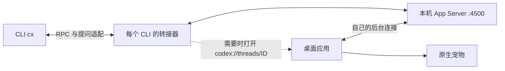

# 实现原理

## 一句话

CLI 与桌面共用本地 App Server；转接器让桌面打开并订阅 CLI 的普通任务，宠物使用桌面已有的任务状态。



后台是本机运行的 Codex 服务进程，负责管理任务和工具执行并调用模型服务；cpet 不在本机部署模型。

## 建立订阅

1. `cx` 准备 launchd 管理的共享后台，并为自己的 CLI 启动临时 WebSocket 转接器。
2. 转接器关联该连接的 `thread/start`、`thread/resume`、`thread/fork` 请求与响应；只有明确 `ephemeral: false` 的成功响应才进入可接入集合。
3. 对未确认订阅的任务执行 `open -g -a <app> codex://threads/<id>`。
4. 桌面打开任务后，用自己的连接调用 `thread/resume`，加载任务并接收后续事件。这与脚本自己建一个订阅连接不同：事件需要到达桌面所持有的连接。
5. 转接器从当前桌面进程的日志检查订阅证据；宠物是否显示仍受桌面 UI 状态影响。

[官方 App Server 文档](https://learn.chatgpt.com/docs/app-server) 说明任务与事件接口；deep link、日志字段和桌面外部后台环境变量是本机实现观察，不构成官方稳定接口承诺。

## 为什么后续提问不再导航

普通任务的 `turn/start` 仍触发检查，但已确认的订阅直接复用。`inactive_thread_unsubscribed` 清除对应任务的缓存；本地后台连接变化、桌面进程变化或日志证据缺口会使缓存失效。页面变为不活跃本身不会清除仍有效的订阅。

未确认状态不会冒充成功；没有明确失效事件时采用 60 秒重试间隔。失效后的恢复在下一次 CLI 接入/提问时发生，不保证桌面重启后正在进行的一轮立即自动恢复气泡。

## 异步提问为什么需要适配

当前验证版本的 CLI 把异步问题保存在自己的界面状态中。桌面回答会进入任务记录，但不会直接关闭 CLI 的原生异步提问控件。`question_sync.py` 为每个 CLI 连接维护独立映射：

1. 只处理该连接成功创建/恢复/分支任务后收到的实时 `agentMessage`，要求 `delivery: async` 且有合法 `questions`。
2. 保留正文，仅移除发给 CLI 的副本里的 `questions`；每个问题另建一个随机 ID 的 `item/tool/requestUserInput`。后台记录与桌面收到的事件不变。
3. 收到已提交的 `userMessage` 时，解析完整的 `send_user_message_question_reply` 信封，按任务 ID、调用 ID、问题序号精确匹配，发送 `serverRequest/resolved` 关闭对应 CLI 提问框。
4. CLI 回答这些合成请求时，转接器消费响应，生成同格式的用户回答。正在运行的任务使用 `turn/steer`（含 `expectedTurnId`），空闲任务使用 `turn/start`；不覆盖权限、模型或沙箱设置。
5. 已完成请求的迟到响应被忽略。提交被拒绝或超时会提示用户去桌面检查，不自动重发，避免超时后重复作答。两个客户端同时提交仍可能竞争，后台没有为本适配器提供跨客户端原子锁。

普通 RPC 与真实审批继续原样转发，合成请求使用独立命名空间。历史分页不是完整的待答清单，因此仅保留历史问题正文，不重建交互框；未回答的历史问题仍可在桌面处理。未知问题结构退回原生行为。`CPET_QUESTION_SYNC=0` 可关闭整个适配器。

提问框使用官方 CLI 已有的标准请求界面；这不是给 CLI 新增界面代码，也不会把后台的异步工具改成同步工具。其界面会占用输入区域，`Esc` 仍按 CLI 标准提问框的行为中断。异步事件字段及桌面回答信封来自特定版本观察，升级后需重新验证。

## 安装模型

```text
任意源码目录 cpet/ -- ./install.sh --> 固定运行目录 runtime/
                                      ├── cpet.py
~/.local/bin/codex-pet ---------------->├── desktop_bridge.py
                                      ├── question_sync.py
                                      ├── requirements.txt
                                      └── .venv/
```

开发 `.venv` 与运行 `.venv` 分开。修改源码不热更新已安装命令；再次安装才部署代码。依赖准备失败时保留已有运行脚本；变更的旧脚本保存在 `runtime-backups/`。命令入口和登录任务都指向稳定安装位置。

## 模块职责

| 文件 | 职责 |
| --- | --- |
| `cpet.py` | 用户级安装、launchd 管理、桌面连接配置、CLI 生命周期和诊断 |
| `desktop_bridge.py` | 转发 RPC、识别任务归属、触发桌面接入并调用提问适配器 |
| `question_sync.py` | 将实时异步提问转换为可关闭的 CLI 提问框，匹配桌面回答并提交 CLI 回答 |
| `install.sh` | 平台/Python 预检查并调用安装入口 |
| `tests/` | 隔离的安装、状态与协议回归测试 |

转接进程随所属 CLI 退出；共享后台由 launchd 管理。结束 CLI 不等于停止共享后台。任务记录仍由 Codex 自身管理，cpet 不改写对话存储。
